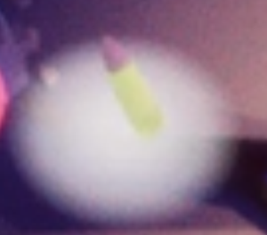
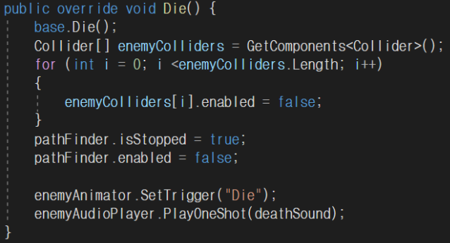

# ZombieSurvivalGame
Making a zombie survival game using C# and unity

# 1. Project Overview (프로젝트 개요)
- 프로젝트 이름: Zombie Survival Game
- 프로젝트 설명: C#과 Unity를 활용한 게임 제작


게임 개발 프로젝트를 진행하게 된 이유는 평소에 Unity 엔진을 이용한 게임을 만들어보고 싶었고, 시연을 할 때에도 친숙하고 재미있게 다가가기 위해 시작하게 되었습니다.
<br/>


게임 중에서 "아이작" 이라는 생존 서바이벌 게임에서 영감을 받게 되었습니다.
<br/>
<br/>

# 2. Members (팀원 소개)
| 허성욱 | 황지우 | 제시헌 | 최연휘 |
|:------:|:------:|:------:|:------:|
|||||
| 경남대학교 | 경남대학교 | 경남대학교 | 경남대학교 |
| [GitHub](https://github.com/dokpe01) | None | None |  None |

<br/>
<br/>

# 3. Key Features (주요 기능)
- **C#**:
  - C#을 활용한 게임 프로그래밍

- **Unity**:
  - 게임 UI를 담당하는 물리 엔진
<br/>
<br/>

# 4. Tasks & Responsibilities (역할 분담)
|  |  |  |
|-----------------|-----------------|-----------------|
| 허성욱    |   | <ul><li>프로젝트 총괄</li><li>C# 프로그래밍</li></ul>     |
| 황지우   |  | <ul><li>C# 프로그래밍</li><li>Unity 개발 보조</li></ul> |
| 제시헌   |      |<ul><li>Unity 개발</li></ul>  |
| 최연휘   |      |<ul><li>필요 자료 조사 및 PPT 제작</li></ul>  |
<br/>
<br/>

# 5. Technology Stack (사용 기술)
|  |  |
|-----------------|-----------------|
| C#    || 
| Unity    |   |

<br/>
<br/>

# 6. Project Structure (프로젝트 구조)
```plaintext
game/
├── Enemy                 # 좀비 관리 파일
├── EnemySpawner          # 좀비 소환 파일
├── GameManager           # 게임 관리 파일
├── ItemSpawner           # 아이템 소환 파일
├── PlayerHealth          # 플레이어 체력 관리 파일
├── PlayerInput           # 플레이어 파일
├── PlayerMovement        # 플레이어 조작 파일
└── PlayerShooter         # 총 발사, 장전 등 무기 관리 파일
```

<br/>
<br/>

# 7. Game Features (게임 기능)
1. 사방에서 좀비들이 끊임없이 플레이어를 향해 달려온다.
2. 플레이어는 총을 사용해 좀비들을 사살하여 점수를 획득한다.
3. 좀비는 일정 주기로 생성되며, 시간이 지날수록 한 번에 생성되는 좀비의 수는 늘어난다.
4. 좀비는 플레이어의 위치를 주기적으로 파악하고 언제나 최적의 경로를 찾아 추적한다.
5. 조작법
   - 이동 : WS or 위아래 방향키
   - 회전 : AD or 좌우 방향키
   - 발사 : 마우스 좌클릭
   - 장전 : R
<br/>
<br/>

6. 좀비의 이동속도, 공격력, 체력은 적정범위 내에서 랜덤으로 지정되며 강하고 빠른 좀비일수록 피부색이 붉어진다.
<br/>


8. 플레이어의 체력은 캐릭터 밑의 Circle Bar로 실시간 확인 가능하다.
<br/>
<br/>

10. 플레이어의 탄창은 무한하지 않고, 체력도 자동으로 회복되지 않는다.
<br/>
<br/>


12. 플레이어는 계속해서 탄알과 체력 회복 아이템을 획득해야 한다.
아이템은 주기적으로 랜덤 위치에 생성되며, 일정시간이 지나면 사라진다.
<br/>
<br/>


14. 후처리(Post-Processing) 효과를 사용해 게임 화면을 보정한다.
    
<br/>
<br/>

# 7. What was difficult during the implementation (구현 중 어려웠던 점)
- 프로그래밍 이후 테스트하는 과정에서 1웨이브에서는 정상적으로 작동하나, 이후 2웨이브부터 생성된 좀비들이 이동, 피격, 공격을 하지 않는 문제가 발생
- Error Code: "SetDestination" can only be called on an active agent that has been placed on a NavMesh. UnityEngine.AI.NavMeshAgent:set_destination(Vector3)
- 2웨이브에 도달할 때마다 위와 같은 Navmesh 에러가 발생
- 해당 부분에 대해 관련된 자료를 조사하여 NavMesh 부분에서 문제가 있음을 확인
  
- NavMesh : 맵 바닥에 파란색으로 표시된 부분으로, Model이 이동 가능한 구역
- NavMeshAgent가 Bake된 NavMesh에 이미 종속되어 활동을 시작했기 때문에 임의로 현재 오브젝트 위치를 변경하는 것을 허용하지 않기 때문에 발생하는 문제

- 따라서 NavMeshAgent를 임의로 끄고 다시 켜주면 해결이 가능하였음
- NavMesh 문제를 해결하고나니 2웨이브부터는 좀비들이 플레이어를 추적하기 시작했지만 피격, 공격은 여전히 하지않음

1. 플레이어가 2웨이브부터 공격, 피격이 되지 않음
2. 좀비가 2웨이브부터 공격, 피격이 되지 않음

- 위 2가지 문제 중 하나일 것이라 판단하여 여러 차례 테스트를 통해 재검토 과정을 거침

- 그 중에서 가장 눈에 띄는 부분은 Zombie(Clone)부분이였고 해당 부분부터 살펴보기 시작하였음

- Collider : 충돌 감지 컴포넌트
- 2웨이브부터 Zombie(Clone)의 Box Collider, Capsule Collider 2가지 콜라이더가 작동하지 않음을 확인
  
- 해당 콜라이더들은 좀비가 사망처리 되었을 때 다른 AI와의 충돌을 피하기 위해 비활성화 시켜둔 부분이였음

- 콜라이더들이 좀비가 새로 생성되었을 때 자동으로 다시 활성화되지 않았던 문제였기 때문에 좀비 생성 시에 콜라이더들을 임의적으로 다시 활성화시켜 문제 해결

<br/>
<br/>

# 8. What I felt while working on the project (프로젝트를 진행하면서 느낀 점)
- 서로 다른 가치관과 각기 다른 관심분야를 가진 팀원들이 모여 의논하던 중, 재미가 있으면서도 의미도 있겠다고 생각한 게임 개발을 주제로 진행하게 되었고 새로운 경험을 바탕으로 Unity에 대해 조금 더 알아갈 수 있었습니다.
- 프로젝트 진행 도중에는 크게 문제가 될 만한 상황이 없었지만 완성이 되고 마지막으로 테스트하는 과정에서 몇가지 문제 상황을 발견하였지만, 팀원 중에 Unity를 사용해봤던 경험이 있는 팀원이 있었기에 조금 더 수월하게 문제를 해결할 수 있었다고 생각합니다. 그 과정을 겪으면서 경험은 역시 무시할게 못된다라고 생각하게 되었으며, 저 또한 다양한 분야에 새로운 시도를 하여 많은 경험을 하고 싶다고 느끼게 되는 계기가 되었습니다.
- 프로젝트의 팀장으로써 책임지고 프로젝트를 기간 안에 반드시 완성시켜야 한다는 중압감도 있었지만 그를 위해서 가장 중요한 것은 커뮤니케이션이라고 생각했습니다. 그렇기 때문에 프로젝트 진행 중에 팀원들 간의 의사소통에 가장 많은 관심을 쏟았고, 팀원들의 여러 의견들(이건 이렇게 해보는게 어떨까요? 이건 이렇게 수정해보는 것도 좋을거 같아요. 등)을 적극 수용하고 여러 진행 방향을 제시하며 일정을 적절하게 조율하여 팀원들 간의 마찰을 최소화하며 프로젝트를 매끄럽게 진행할 수 있는 방향으로 진행했습니다. 결과적으로 프로젝트는 여유롭게 마무리 지을 수 있었고, 처음 해보는 팀장이였지만 굉장히 의미있는 경험이 되었다고 생각합니다.
